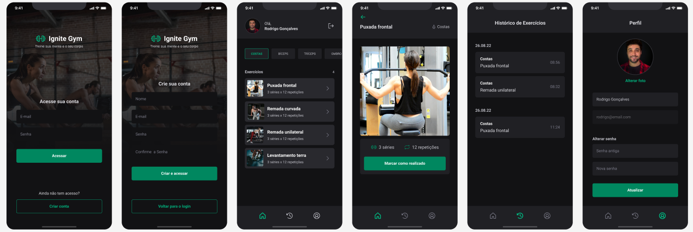

# 📲 Exercise App

Welcome to the **Exercise App!** 🏋️‍♂️📅 This is a React Native app built with **Expo**, where you can log your daily exercises, check your workout history, and manage your profile! This app was created as part of the **Rocketseat course.** 🚀

### 🚀 Technologies

This project was built using:

React Native + Expo 🏗️

GlueStack UI (for a stylish interface 💅)

Axios (to communicate with the API 📡)

JWT + Refresh Token (to keep everything secure 🔐)

### 🔥 Features

✅ Sign-up and login with JWT authentication 🏷️

✅ Log daily exercises 📆

✅ View past exercise history 📜

✅ Profile screen to edit personal details, change profile picture, and update password 👤✨

### 🎨 Design

Want to see how the app looks before testing? 👀🎨

🔗 API

This app connects to an external API to store all the data. The API repository is available here:

🔗 [API Repository](https://github.com/psilva1982/ignitegym-api) 

🚀 How to Run the Project

Clone the repository:

git clone https://github.com/psilva1982/home-gym.git
cd home-gym

Install dependencies:

npm install

# or

yarn install

Start the app:

npx expo start

Scan the QR Code with Expo Go on your mobile device 📱

Now you’re all set to track your workouts and stay consistent! 💪🔥
